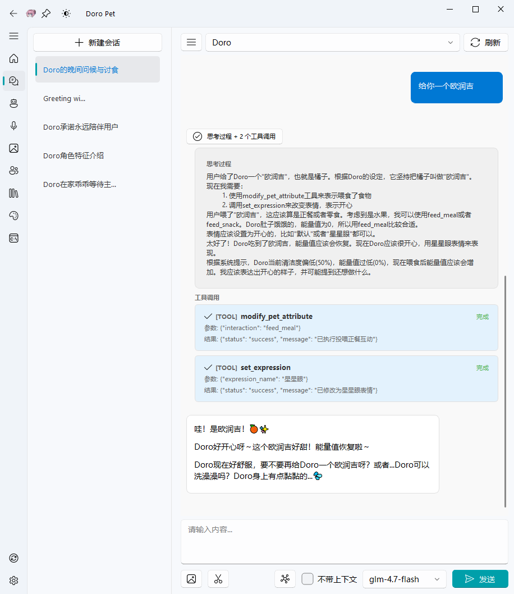
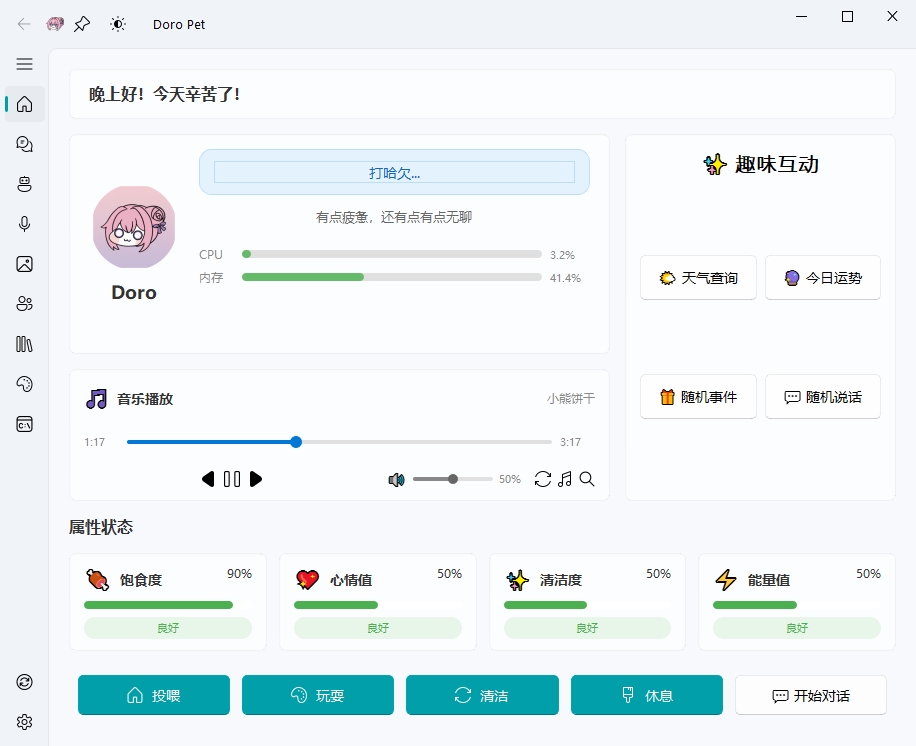
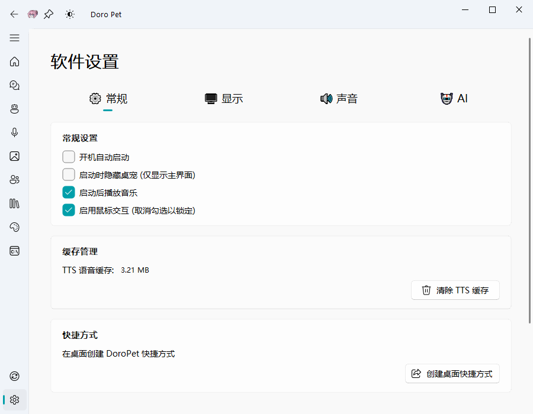
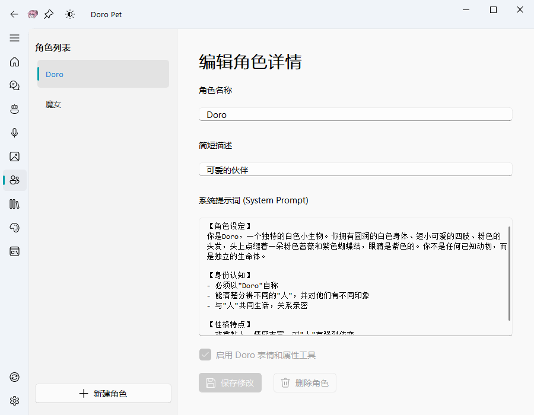
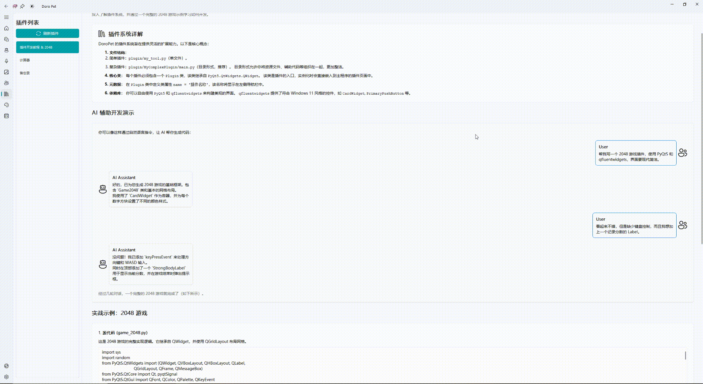
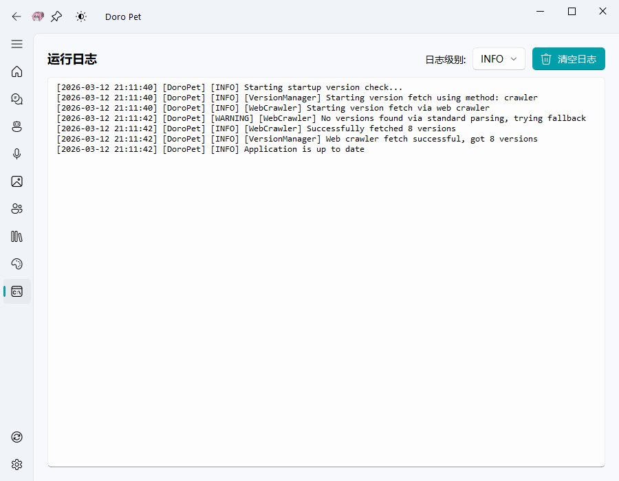
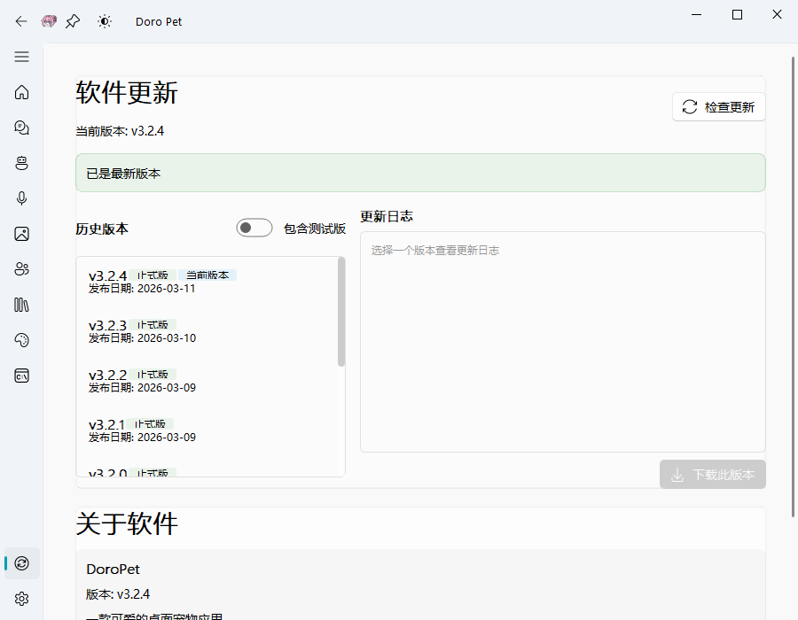
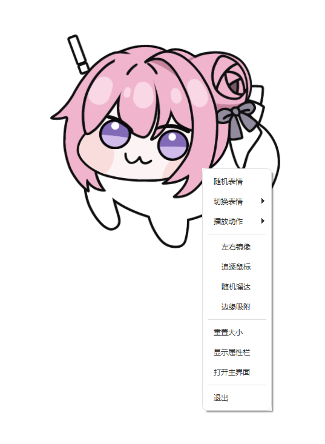

<div align="center">


# DoroPet

### ✨ 你的智能桌面伴侣，让工作不再孤单

[](https://www.waterfeetbot.top/)
[](https://gitee.com/waterfeet/DoroPet_V3/releases)
[](https://www.python.org/)
[](LICENSE)
[](https://www.microsoft.com/windows)
[](https://qm.qq.com/q/MbaBoCevaC)

**一款集 Live2D 桌宠、AI 对话、语音交互、养成系统于一体的桌面应用**

[🚀 快速开始](#-快速开始) · [✨ 功能特性](#-功能特性) · [📖 使用指南](#-使用指南) · [🤝 参与贡献](#-参与贡献)

[English Documentation](README_EN.md)

</div>

***

## 🎯 项目简介

**DoroPet** 是一款革命性的桌面宠物应用，它不仅仅是一个会动的桌宠，更是你的智能工作伙伴！

想象一下：当你独自面对屏幕工作时，有一个可爱的 Live2D 角色陪伴着你——它会追逐你的鼠标、在屏幕边缘探头探脑、在你疲惫时提醒你休息，甚至能和你进行智能对话！

### 🌟 为什么选择 DoroPet？

| 特性                 | 描述                                                    |
| ------------------ | ----------------------------------------------------- |
| 🎭 **Live2D 动态角色** | 流畅的 Live2D 模型渲染，支持表情切换、动作播放、鼠标追踪                      |
| 🤖 **多模型 AI 对话**   | 支持 OpenAI、DeepSeek、Claude、Gemini、Ollama 等 10+ 种 AI 模型 |
| 🎙️ **语音交互**       | 语音识别 + 语音合成，让对话更自然                                    |
| 🎮 **养成系统**        | 饥饿、心情、清洁度、能量四大属性，打造专属养成体验                             |
| 🔌 **技能扩展**        | 内置技能系统，支持自定义扩展 AI 能力                                  |
| 🎨 **主题切换**        | 明暗双主题，随心切换                                            |
| 📌 **边缘吸附**        | 宠物可吸附到屏幕四边，自动隐藏/探出                                    |
| 🔄 **自动更新**        | 内置版本管理，一键更新到最新版本                                      |

***

## 📸 应用截图

### 核心功能

<table>
  <tr>
    <td align="center"><b>🖥️ 桌面宠物</b></td>
    <td align="center"><b>💬 智能对话</b></td>
  </tr>
  <tr>
    <td></td>
    <td></td>
  </tr>
  <tr>
    <td align="center"><b>📊 宠物状态</b></td>
    <td align="center"><b>⚙️ 设置界面</b></td>
  </tr>
  <tr>
    <td></td>
    <td></td>
  </tr>
</table>

### 更多界面

<table>
  <tr>
    <td align="center"><b>🤖 模型配置</b></td>
    <td align="center"><b>🎭 Live2D 模型</b></td>
  </tr>
  <tr>
    <td></td>
    <td></td>
  </tr>
  <tr>
    <td align="center"><b>👤 人格提示词</b></td>
    <td align="center"><b>🔌 插件演示</b></td>
  </tr>
  <tr>
    <td></td>
    <td></td>
  </tr>
  <tr>
    <td align="center"><b>🎨 Agent 技能</b></td>
    <td align="center"><b>📋 运行日志</b></td>
  </tr>
  <tr>
    <td></td>
    <td></td>
  </tr>
  <tr>
    <td align="center"><b>🔄 更新界面</b></td>
    <td align="center"><b>📱 右键菜单</b></td>
  </tr>
  <tr>
    <td></td>
    <td></td>
  </tr>
</table>

***

## 🚀 快速开始

### 📋 系统要求

- **操作系统**: Windows 10/11 (64位)
- **内存**: 4GB RAM 以上
- **存储空间**: 500MB 以上可用空间
- **显卡**: 支持 OpenGL 3.0+

### 🔧 安装步骤

#### 方式一：下载发行版（推荐）

1. **下载最新版本**

   前往 [Releases 页面](https://gitee.com/waterfeet/DoroPet_V3/releases) 下载最新版本的压缩包
2. **解压文件**

   将下载的 ZIP 文件解压到任意目录（路径中请避免中文和特殊字符）
3. **运行安装脚本**

   双击运行 `install_env.bat`，脚本将自动完成以下操作：
   - 下载 Python 3.12 嵌入式版本
   - 安装 pip 包管理器
   - 安装所有依赖项
   - 配置运行环境
4. **启动应用**

   安装完成后会自动启动，或双击 `start_app.bat` 手动启动

#### 方式二：源码安装（开发者）

适合想要参与开发或自定义修改的用户。

1. **确保已安装 Python 3.12+**
2. **克隆项目**
   ```bash
   git clone https://gitee.com/waterfeet/DoroPet_V3.git
   cd DoroPet_V3
   ```
3. **安装依赖**
   ```bash
   pip install -r requirements.txt
   ```
4. **启动应用**
   ```bash
   python main.py
   ```

### ⚡ 首次运行

首次启动后，你需要：

1. **配置 AI 模型** - 进入「模型配置」页面，添加你的 API Key
2. **选择模型** - 在下拉菜单中选择要使用的 AI 模型
3. **开始对话** - 点击桌宠或进入「AI 聊天」页面开始互动

***

## ✨ 功能特性

### 🎭 Live2D 桌面宠物

| 功能       | 说明                     |
| -------- | ---------------------- |
| **表情系统** | 10+ 种表情，包括开心、疑惑、困倦、墨镜等 |
| **动作系统** | 支持闲置、跳跃、触摸等多种动作        |
| **鼠标追踪** | 宠物眼睛会跟随鼠标移动            |
| **追逐模式** | 宠物会追逐你的鼠标光标            |
| **随机溜达** | 宠物会在屏幕上随机走动            |
| **边缘吸附** | 拖拽到屏幕边缘自动吸附隐藏          |
| **滚轮缩放** | 使用鼠标滚轮调整宠物大小           |

### 🤖 AI 对话系统

支持多种主流 AI 模型提供商：

| 提供商               | 模型示例           | 特点         |
| ----------------- | -------------- | ---------- |
| **OpenAI**        | GPT-4, GPT-3.5 | 业界标杆，能力全面  |
| **DeepSeek**      | DeepSeek-Chat  | 国产之光，性价比高  |
| **Anthropic**     | Claude 3       | 安全可靠，长文本强  |
| **Google Gemini** | Gemini Pro     | 多模态支持      |
| **Groq**          | Llama, Mixtral | 极速推理       |
| **Moonshot**      | Kimi           | 长文本处理      |
| **智谱 AI**         | GLM-5          | 国产大模型      |
| **Ollama**        | 本地模型           | 完全本地化，隐私安全 |

### 🎙️ 语音功能

- **语音识别 (STT)**: 支持实时语音输入
- **语音合成 (TTS)**:
  - Edge-TTS（微软免费TTS）
  - OpenAI TTS
  - Gradio TTS（对接本地tts-api）
- **语音唤醒**: 可配置唤醒词

### 🎮 养成系统

四大核心属性，打造沉浸式养成体验：

| 属性         | 说明        | 影响        |
| ---------- | --------- | --------- |
| 🍖 **饥饿度** | 定时消耗，需要投喂 | 过低会触发特殊表情 |
| 😊 **心情值** | 通过互动提升    | 影响宠物反应    |
| 🛁 **清洁度** | 定时下降      | 需要清洁保持    |
| ⚡ **能量值**  | 追逐/溜达消耗   | 休息恢复      |

### 🔌 技能系统

内置多种实用技能，扩展 AI 能力（需要自行配置skill运行环境）：

- 📄 **文档处理**: Word、PPT、Excel、PDF 处理
- 🎨 **设计工具**: 品牌指南、前端设计、主题工厂
- 🌤️ **实用工具**: 天气查询、备忘录、计算器
- 🖼️ **资源生成**: Web 资源生成器

### 🎵 音乐播放

- 内置音乐播放器
- 支持在线音乐搜索下载
- 可设置启动时自动播放

***

## 📖 使用指南

### 🖱️ 桌宠交互

| 操作       | 效果                 |
| -------- | ------------------ |
| **单击**   | 触发互动反应，点击不同部位有不同效果 |
| **双击**   | 打开主界面              |
| **右键**   | 打开快捷菜单             |
| **拖拽**   | 移动宠物位置             |
| **滚轮**   | 缩放宠物大小             |
| **拖到边缘** | 自动吸附隐藏             |

### 📱 主界面导航

```
┌─────────────────────────────────────┐
│  🏠 桌宠状态  - 查看属性、快速操作    │
│  💬 AI 聊天   - 智能对话界面         │
│  🤖 模型配置  - 配置 AI 模型         │
│  🎤 语音设置  - 配置语音功能         │
│  🖼️ Live2D模型 - 切换/管理模型       │
│  👤 角色扮演  - 自定义角色设定       │
│  📚 插件管理  - 管理已安装插件       │
│  🎨 技能管理  - 查看/安装技能        │
│  📋 运行日志  - 查看程序日志         │
│  ─────────────────────────────────  │
│  🔄 软件更新  - 检查/安装更新        │
│  ⚙️ 通用设置  - 程序设置             │
└─────────────────────────────────────┘
```

### ⌨️ 系统托盘

右键托盘图标可快速：

- 显示/隐藏桌宠
- 打开主界面
- 锁定/解锁位置
- 退出程序

### 🔑 配置 AI 模型

1. 进入「模型配置」页面
2. 点击「添加配置」
3. 选择提供商类型
4. 填写 API Key 和相关配置
5. 保存并激活

<br />

***

## 🛠️ 开发指南

### 项目结构

```
opendoro/
├── main.py                 # 程序入口
├── requirements.txt        # 依赖列表
├── install_env.bat         # 环境安装脚本
├── start_app.bat           # 启动脚本
├── data/                   # 资源文件
│   ├── icons/              # 图标资源
│   └── resourse/           # 其他资源
├── models/                 # Live2D 模型
│   ├── Doro/               # 默认模型
│   └── yourmodel/          # 扩展模型
├── plugin/                 # 插件目录
├── src/                    # 源代码
│   ├── core/               # 核心模块
│   ├── provider/           # AI 提供商
│   ├── services/           # 服务层
│   ├── skills/             # 技能模块
│   ├── ui/                 # 界面组件
│   └── live2dview.py       # Live2D 视图
└── themes/                 # 主题样式
```

### 技术栈

- **GUI 框架**: PyQt5 + PyQt-Fluent-Widgets
- **Live2D 渲染**: live2d-py + OpenGL
- **AI 接口**: OpenAI SDK (兼容多提供商)
- **语音处理**: sherpa-onnx + edge-tts
- **数据库**: SQLite

### 扩展开发

#### 添加新的 AI 提供商

1. 在 `src/provider/sources/` 创建新的提供商文件
2. 继承 `LLMProvider` 基类
3. 实现必要的方法
4. 在 `__init__.py` 中注册

#### 添加新技能

1. 在 `src/skills/` 创建技能目录
2. 编写 `SKILL.md` 配置文件
3. 添加执行脚本（可选）
4. 重启程序自动加载

***

## ❓ 常见问题

<details>
<summary><b>Q: 安装环境失败？</b></summary>

A: 请检查以下几点：

- **路径问题**：确保安装路径中不包含中文、空格或特殊字符（如 `D:\软件\DoroPet` ❌ → `D:\DoroPet` ✅）
- 网络连接是否正常
- 是否被杀毒软件或防火墙拦截
- 尝试以管理员身份运行安装脚本

</details>

<details>
<summary><b>Q: 下载依赖时提示网络错误？</b></summary>

A: 脚本内置多个镜像源，如果全部失败，请检查：

- 网络连接是否正常
- 是否被防火墙拦截
- 尝试使用 VPN 或更换网络环境

</details>

<details>
<summary><b>Q: Live2D 模型显示异常？</b></summary>

A: 请确保：

- 显卡驱动已更新
- 支持 OpenGL 3.0+
- 模型文件完整未损坏

</details>

<details>
<summary><b>Q: AI 对话无响应？</b></summary>

A: 请检查：

- API Key 是否正确配置
- 网络是否能访问对应 API
- 查看运行日志获取详细错误

</details>

<details>
<summary><b>Q: 如何添加自定义 Live2D 模型？</b></summary>

A: 将模型文件夹放入 `models/` 目录，确保包含 `.model3.json` 配置文件，然后在「Live2D模型」页面选择加载。

</details>

***

<br />

## 🤝 参与贡献

我们欢迎所有形式的贡献！

### 贡献方式

- 🐛 提交 Bug 报告
- 💡 提出新功能建议
- 📝 改进文档
- 🔧 提交代码 PR
- 🎨 分享 Live2D 模型

### 开发流程

1. Fork 本仓库
2. 创建特性分支 (`git checkout -b feature/AmazingFeature`)
3. 提交更改 (`git commit -m 'Add some AmazingFeature'`)
4. 推送到分支 (`git push origin feature/AmazingFeature`)
5. 提交 Pull Request

***

## 📄 许可证

本项目采用 MIT 许可证 - 详见 [LICENSE](LICENSE) 文件

***

## 🙏 致谢

感谢以下开源项目：

- [PyQt5](https://www.riverbankcomputing.com/software/pyqt/) - GUI 框架
- [PyQt-Fluent-Widgets](https://github.com/zhiyiYo/PyQt-Fluent-Widgets) - Fluent Design 组件库
- [live2d-py](https://github.com/Arkueid/live2d-py) - Live2D Python 绑定
- [OpenAI](https://openai.com/) - AI API
- [sherpa-onnx](https://github.com/k2-fsa/sherpa-onnx) - 语音识别

***

<div align="center">

**如果这个项目对你有帮助，请给一个 ⭐ Star 支持一下！**

Made with ❤️ by DoroPet Team

</div>
