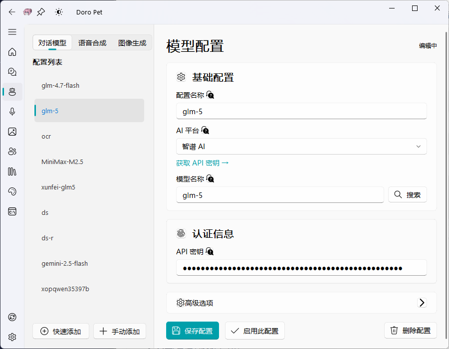

<div align="center">

# 🐱 DoroPet

### ✨ Your Intelligent Desktop Companion

[](https://gitee.com/waterfeet/DoroPet_V3/releases)
[](https://www.python.org/)
[](LICENSE)
[](https://www.microsoft.com/windows)
[](https://qm.qq.com/q/MbaBoCevaC)

**A desktop application featuring Live2D pets, AI chat, voice interaction, and pet simulation system**

[🚀 Quick Start](#-quick-start) · [✨ Features](#-features) · [📖 User Guide](#-user-guide) · [🤝 Contributing](#-contributing)

[中文文档](README.md)

</div>

---

## 🎯 Introduction

**DoroPet** is a revolutionary desktop pet application. It's not just an animated pet on your screen—it's your intelligent work companion!

Imagine having a cute Live2D character accompanying you while you work alone at your computer. It chases your mouse cursor, peeks out from screen edges, reminds you to rest when you're tired, and even engages in intelligent conversations with you!

### 🌟 Why Choose DoroPet?

| Feature | Description |
|---------|-------------|
| 🎭 **Live2D Dynamic Character** | Smooth Live2D model rendering with expression switching, motion playback, and mouse tracking |
| 🤖 **Multi-Model AI Chat** | Supports 10+ AI models including OpenAI, DeepSeek, Claude, Gemini, Ollama, and more |
| 🎙️ **Voice Interaction** | Speech recognition + Text-to-Speech for natural conversations |
| 🎮 **Pet Simulation System** | Four attributes: Hunger, Mood, Cleanliness, and Energy for an immersive experience |
| 🔌 **Skill Extensions** | Built-in skill system with customizable AI capabilities |
| 🎨 **Theme Switching** | Light and dark themes to suit your preference |
| 📌 **Edge Docking** | Pet can dock to screen edges and auto-hide/peek |
| 🔄 **Auto Update** | Built-in version management for one-click updates |

---

## 📸 Screenshots

<table>
  <tr>
    <td align="center"><b>🖥️ Desktop Pet</b></td>
    <td align="center"><b>💬 AI Chat</b></td>
  </tr>
  <tr>
    <td></td>
    <td></td>
  </tr>
  <tr>
    <td align="center"><b>📊 Pet Status</b></td>
    <td align="center"><b>⚙️ Settings</b></td>
  </tr>
  <tr>
    <td></td>
    <td></td>
  </tr>
</table>

---

## 🚀 Quick Start

### 📋 System Requirements

- **OS**: Windows 10/11 (64-bit)
- **RAM**: 4GB or more
- **Storage**: 500MB+ available space
- **GPU**: OpenGL 3.0+ support

### 🔧 Installation

#### Method 1: Download Release (Recommended)

1. **Download Latest Version**
   
   Visit the [Releases Page](https://gitee.com/waterfeet/DoroPet_V3/releases) to download the latest ZIP package

2. **Extract Files**
   
   Extract the downloaded ZIP file to any directory (avoid Chinese characters or special characters in the path)

3. **Run Installation Script**
   
   Double-click `install_env.bat`, the script will automatically:
   - Download Python 3.12 embedded version
   - Install pip package manager
   - Install all dependencies
   - Configure the runtime environment

4. **Launch Application**
   
   The app will start automatically after installation, or double-click `start_app.bat` to launch manually

#### Method 2: Build from Source (Developers)

For users who want to contribute or customize the application.

1. **Ensure Python 3.12+ is installed**

2. **Clone the repository**
   ```bash
   git clone https://gitee.com/waterfeet/DoroPet_V3.git
   cd DoroPet_V3
   ```

3. **Install dependencies**
   ```bash
   pip install -r requirements.txt
   ```

4. **Launch application**
   ```bash
   python main.py
   ```

### ⚡ First Run

After launching for the first time:

1. **Configure AI Model** - Go to "Model Config" page and add your API Key
2. **Select Model** - Choose your preferred AI model from the dropdown
3. **Start Chatting** - Click the pet or go to "AI Chat" page to interact

---

## ✨ Features

### 🎭 Live2D Desktop Pet

| Feature | Description |
|---------|-------------|
| **Expression System** | 10+ expressions including happy, confused, sleepy, cool, etc. |
| **Motion System** | Supports idle, jump, touch, and other motions |
| **Mouse Tracking** | Pet's eyes follow your mouse cursor |
| **Chase Mode** | Pet chases your mouse cursor around the screen |
| **Random Wander** | Pet walks randomly on the screen |
| **Edge Docking** | Automatically docks and hides when dragged to screen edges |
| **Scroll Resize** | Use mouse wheel to resize the pet |

### 🤖 AI Chat System

Supports multiple mainstream AI model providers:

| Provider | Models | Features |
|----------|--------|----------|
| **OpenAI** | GPT-4, GPT-3.5 | Industry leader, comprehensive capabilities |
| **DeepSeek** | DeepSeek-Chat | Excellent value, Chinese optimized |
| **Anthropic** | Claude 3 | Safe and reliable, great for long texts |
| **Google Gemini** | Gemini Pro | Multimodal support |
| **Groq** | Llama, Mixtral | Ultra-fast inference |
| **Moonshot** | Kimi | Long text processing |
| **Zhipu AI** | GLM-4 | Chinese large language model |
| **Ollama** | Local Models | Fully local, privacy-focused |

### 🎙️ Voice Features

- **Speech-to-Text (STT)**: Real-time voice input support
- **Text-to-Speech (TTS)**:
  - Edge-TTS (Microsoft free TTS)
  - OpenAI TTS
  - Gradio TTS (connect to local tts-api)
- **Voice Wake-up**: Configurable wake words

### 🎮 Pet Simulation System

Four core attributes for an immersive experience:

| Attribute | Description | Effect |
|-----------|-------------|--------|
| 🍖 **Hunger** | Decreases over time, needs feeding | Triggers special expressions when low |
| 😊 **Mood** | Increases through interaction | Affects pet reactions |
| 🛁 **Cleanliness** | Decreases over time | Needs cleaning to maintain |
| ⚡ **Energy** | Consumed by chase/wander modes | Restored by resting |

### 🔌 Skill System

Built-in practical skills to extend AI capabilities (requires skill runtime configuration):

- 📄 **Document Processing**: Word, PPT, Excel, PDF handling
- 🎨 **Design Tools**: Brand guidelines, frontend design, theme factory
- 🌤️ **Utilities**: Weather, memo, calculator
- 🖼️ **Resource Generation**: Web asset generator

### 🎵 Music Player

- Built-in music player
- Online music search and download
- Auto-play on startup option

---

## 📖 User Guide

### 🖱️ Pet Interactions

| Action | Effect |
|--------|--------|
| **Single Click** | Triggers interaction, different effects on different body parts |
| **Double Click** | Opens main interface |
| **Right Click** | Opens context menu |
| **Drag** | Move pet position |
| **Scroll** | Resize pet |
| **Drag to Edge** | Auto dock and hide |

### 📱 Main Interface Navigation

```
┌─────────────────────────────────────┐
│  🏠 Pet Status  - View attributes, quick actions    │
│  💬 AI Chat     - Intelligent conversation          │
│  🤖 Model Config - Configure AI models              │
│  🎤 Voice Settings - Configure voice features       │
│  🖼️ Live2D Model - Switch/manage models             │
│  👤 Role Play   - Custom character settings         │
│  📚 Plugins     - Manage installed plugins          │
│  🎨 Skills      - View/install skills               │
│  📋 Logs        - View application logs             │
│  ─────────────────────────────────  │
│  🔄 Updates     - Check/install updates             │
│  ⚙️ Settings    - Application settings              │
└─────────────────────────────────────┘
```

### ⌨️ System Tray

Right-click the tray icon to quickly:

- Show/Hide pet
- Open main interface
- Lock/Unlock position
- Exit application

### 🔑 Configure AI Model

1. Go to "Model Config" page
2. Click "Add Config"
3. Select provider type
4. Enter API Key and related settings
5. Save and activate

**Get API Keys**:
- OpenAI: https://platform.openai.com/api-keys
- DeepSeek: https://platform.deepseek.com/
- Anthropic: https://console.anthropic.com/

---

## 🛠️ Development Guide

### Project Structure

```
opendoro/
├── main.py                 # Application entry
├── requirements.txt        # Dependencies
├── install_env.bat         # Environment setup script
├── start_app.bat           # Launch script
├── data/                   # Resource files
│   ├── icons/              # Icon resources
│   └── resourse/           # Other resources
├── models/                 # Live2D models
│   ├── Doro/               # Default model
│   └── yourmodel/          # Custom models
├── plugin/                 # Plugins directory
├── src/                    # Source code
│   ├── core/               # Core modules
│   ├── provider/           # AI providers
│   ├── services/           # Service layer
│   ├── skills/             # Skill modules
│   ├── ui/                 # UI components
│   └── live2dview.py       # Live2D view
└── themes/                 # Theme stylesheets
```

### Tech Stack

- **GUI Framework**: PyQt5 + PyQt-Fluent-Widgets
- **Live2D Rendering**: live2d-py + OpenGL
- **AI Interface**: OpenAI SDK (multi-provider compatible)
- **Voice Processing**: sherpa-onnx + edge-tts
- **Database**: SQLite

### Extension Development

#### Add New AI Provider

1. Create a new provider file in `src/provider/sources/`
2. Inherit from `LLMProvider` base class
3. Implement required methods
4. Register in `__init__.py`

#### Add New Skill

1. Create a skill directory in `src/skills/`
2. Write a `SKILL.md` configuration file
3. Add execution scripts (optional)
4. Restart the application to auto-load

---

## ❓ FAQ

<details>
<summary><b>Q: Environment installation failed?</b></summary>

A: Please check the following:
- **Path Issue**: Ensure the installation path doesn't contain Chinese characters, spaces, or special characters (e.g., `D:\软件\DoroPet` ❌ → `D:\DoroPet` ✅)
- Check network connection
- Check if blocked by antivirus or firewall
- Try running the installation script as administrator
</details>

<details>
<summary><b>Q: Network error when downloading dependencies?</b></summary>

A: The script has built-in multiple mirror sources. If all fail, please check:
- Network connection status
- Firewall settings
- Try using VPN or switch network environment
</details>

<details>
<summary><b>Q: Live2D model display issues?</b></summary>

A: Please ensure:
- Graphics driver is up to date
- OpenGL 3.0+ is supported
- Model files are complete and not corrupted
</details>

<details>
<summary><b>Q: AI chat not responding?</b></summary>

A: Please check:
- API Key is correctly configured
- Network can access the corresponding API
- Check runtime logs for detailed errors
</details>

<details>
<summary><b>Q: How to add custom Live2D models?</b></summary>

A: Place the model folder in the `models/` directory, ensure it contains a `.model3.json` configuration file, then select and load it from the "Live2D Model" page.
</details>

---

## 🗺️ Roadmap

- [ ] macOS support
- [ ] More Live2D models
- [ ] Multiple pets on screen
- [ ] Cloud sync for settings
- [ ] Community model marketplace
- [ ] More AI capabilities integration

---

## 🤝 Contributing

We welcome all forms of contributions!

### Ways to Contribute

- 🐛 Submit bug reports
- 💡 Propose new features
- 📝 Improve documentation
- 🔧 Submit code PRs
- 🎨 Share Live2D models

### Development Workflow

1. Fork this repository
2. Create a feature branch (`git checkout -b feature/AmazingFeature`)
3. Commit your changes (`git commit -m 'Add some AmazingFeature'`)
4. Push to the branch (`git push origin feature/AmazingFeature`)
5. Submit a Pull Request

---

## 📄 License

This project is licensed under the MIT License - see the [LICENSE](LICENSE) file for details.

---

## 🙏 Acknowledgments

Thanks to the following open source projects:

- [PyQt5](https://www.riverbankcomputing.com/software/pyqt/) - GUI Framework
- [PyQt-Fluent-Widgets](https://github.com/zhiyiYo/PyQt-Fluent-Widgets) - Fluent Design component library
- [live2d-py](https://github.com/Arkueid/live2d-py) - Live2D Python binding
- [OpenAI](https://openai.com/) - AI API
- [sherpa-onnx](https://github.com/k2-fsa/sherpa-onnx) - Speech recognition

---

<div align="center">

**If this project helps you, please give it a ⭐ Star!**

Made with ❤️ by DoroPet Team

</div>
